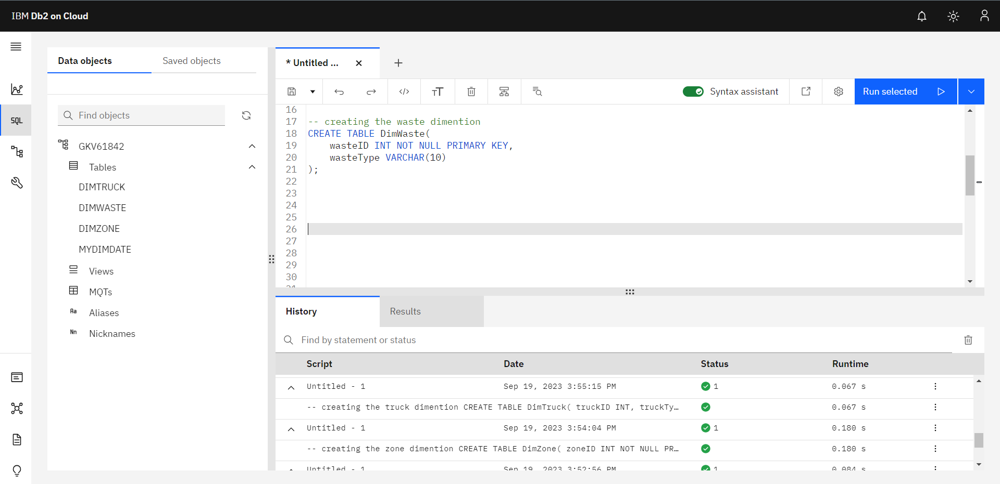
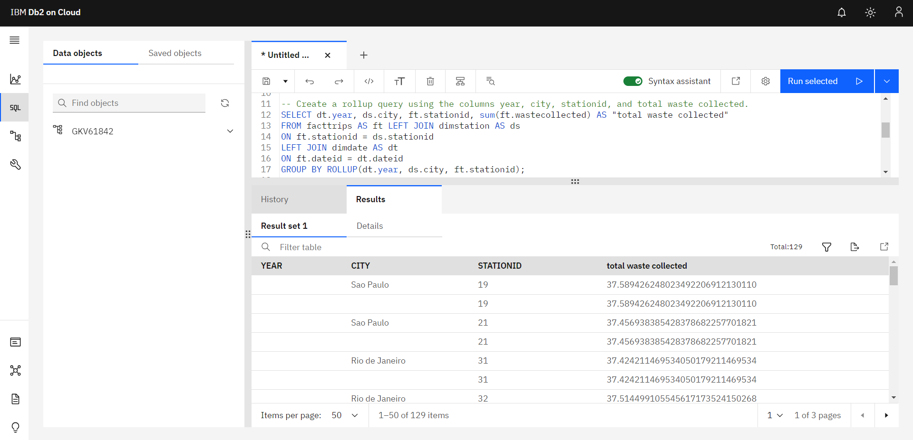

# Waste Management Data Warehouse and Reporting System
Building a data warehouse for waste management to enable reporting on waste collection and recycling operations in Brazilian cities.

## Project Description:
This project involves a data engineer role at a solid waste management company. The company collects and recycles solid waste across major cities in the country of Brazil. The company operates hundreds of trucks of different types to collect and transport solid waste. The company would like to create a data warehouse so that it can create reports. 
click **[here](#dashboard)** to go to the dashboard directly.

This project is from **"Getting Started with Data Warehousing and BI Analytics"** course offerred by **IBM** in **Coursera**. 

### Tools:
> In this project I used **IBM DB2 Cloud** for desinging and quering our data warehouse, 
> and **IBM Cognos Analytics** for reporting.  

### Objectives:
> * Design a Data Warehouse
> * Load data into Data Warehouse
> * Write aggregation queries
> * Create MQTs
> * Create a Dashboard
  

## Implementation Steps:
## Design 
Our first task is to **design the data warehouse structure**. We create essential dimensions, including DimDate for time-related data, DimWaste for waste types, DimZone for collection zones, and DimTruck for truck types. These dimensions act as organized containers for their respective information categories. Additionally, we establish the FactTrips table to record trip-specific details like trip numbers, date references, waste types, collection zones, truck types, and waste collection quantities. It provided as following: 
#### DimDate:
*	dateID
*	date
*	year
*	quarter
*	quarterName 
*	month 
*	monthName 
*	day
*	weekday
*	weekdayName

 
#### DimWaste:
*	wasteID 
*	wasteType 

#### DimZone:
*	zoneID 
*	collectionZone 
*	City 

#### DimTruck:
*	truckID 
*	truckType 

#### FactTrips:
*	tripNum_SK 
*	dateID 
*	wasteID 
*	zoneID 
*	truckID 
*	wastecollintns 

### Snapshots
  
  
  
  
   

And this we **load the data** into created data warehouse. 
   

## Quering 
In this phase, we **write aggregation queries** using techniques like grouping sets, cube, and rollup to analyze our waste management data, allowing us to aggregate information at various levels of granularity. Additionally, we **create Materialized Query Tables (MQTs)** to store precomputed results, enhancing query performance and facilitating quicker access to frequently used aggregated data. 

* **Grouping Sets**
  
   

* **Cube**

   

* **Rollup**

   

* **Materialized Query Table** (MQT) 

   

## Create a Dashboard
As the final phase of our project, we are dedicated to creating a user-friendly reporting dashboard that will offer valuable insights into waste collection and recycling operations in Brazilian cities. 

   

